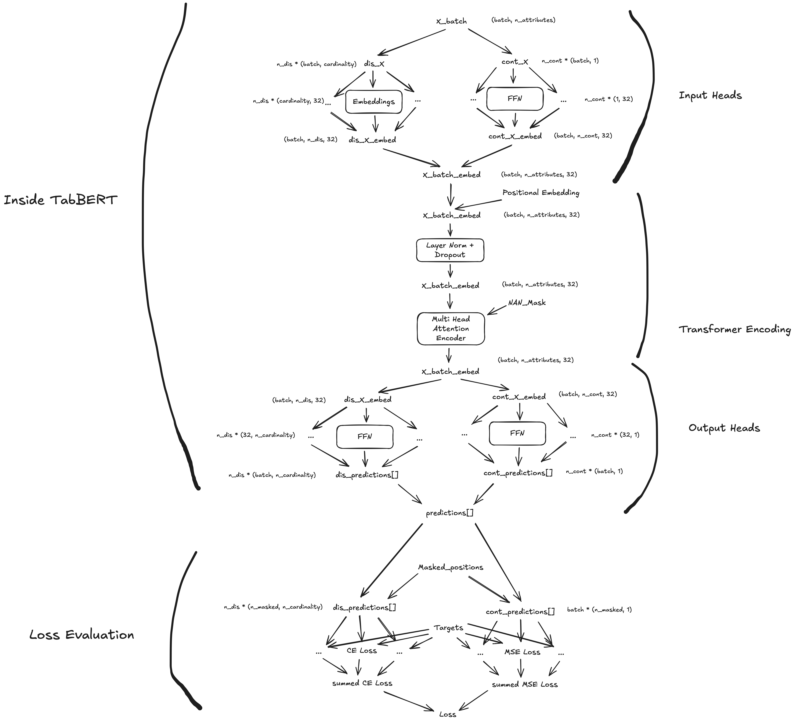

# Architectures

Neural Blueprints includes several pre-built architectures built on top of the component system.

---

## Multi-Layer Perceptron (MLP)

The **Multi-Layer Perceptron** is defined in:

`src/neural_blueprints/architectures/mlp.py`

### 🔗 API Documentation

- [`MLP`](../../reference/neural_blueprints/architectures/mlp/#neural_blueprints.architectures.mlp.MLP)
- [`MLPConfig`](../../reference/neural_blueprints/config/architectures/#neural_blueprints.config.architectures.MLPConfig)

### Example: Building a MLP

```python
from neural_blueprints.architectures import MLP
from neural_blueprints.config import MLPConfig

# Define model configuration
mlp_config = MLPConfig(
    input_dim=15,
    hidden_dims=[64, 32, 16],
    output_dim=1,
    normalization=None,
    activation='relu',
    final_activation=None
)

# Initialize model
model = MLP(mlp_config)
model.blueprint()
```

See examples:

- [Jupiter Notebook](https://github.com/elnukakujo/neural-blueprints/blob/main/examples/example_mlp.ipynb)
- [Python Script](https://github.com/elnukakujo/neural-blueprints/blob/main/examples/example_mlp.py)

---

## Convolutional Neural Network (CNN)

The **Convolutional Neural Network** is defined in:

`src/neural_blueprints/architectures/cnn.py`

### 🔗 API Documentation

- [`CNN`](../../reference/neural_blueprints/architectures/cnn/#neural_blueprints.architectures.cnn.CNN)
- [`CNNConfig`](../../reference/neural_blueprints/config/architectures/#neural_blueprints.config.architectures.CNNConfig)

### Example: Building a CNN

```python
from neural_blueprints.architectures import CNN
from neural_blueprints.config import CNNConfig, ConvLayerConfig, PoolingLayerConfig, FeedForwardNetworkConfig

# Define CNN configuration
cnn_config = CNNConfig(
    layer_types=['conv2d', 'pool2d', 'conv2d', 'pool2d', 'flatten'],
    layer_configs=[
        ConvLayerConfig(in_channels=1, out_channels=16, kernel_size=3, stride=1, padding=1),
        PoolingLayerConfig(pool_type='max', kernel_size=2, stride=2),
        ConvLayerConfig(in_channels=16, out_channels=32, kernel_size=3, stride=1, padding=1),
        PoolingLayerConfig(pool_type='max', kernel_size=2, stride=2),
        {}  # flatten layer does not need a config
    ],
    feedforward_config=FeedForwardNetworkConfig(input_dim=32 * 7 * 7, hidden_dims=[128], output_dim=10),
    final_activation=None
)

# Initialize CNN model
model = CNN(cnn_config)
model.blueprint()
```

See examples:

- [Jupiter Notebook](https://github.com/elnukakujo/neural-blueprints/blob/main/examples/example_cnn.ipynb)
- [Python Script](https://github.com/elnukakujo/neural-blueprints/blob/main/examples/example_cnn.py)

---

## Autoencoder and Variational Autoencoder (VAE)

The **Autoencoder** and the **VariationalAutoEncoder** are defined in:

`src/neural_blueprints/architectures/autoencoder.py`

### 🔗 API Documentation

- [`AutoEncoder`](../../reference/neural_blueprints/architectures/autoencoder/#neural_blueprints.architectures.autoencoder.AutoEncoder)
- [`VariationalAutoEncoder`](../../reference/neural_blueprints/architectures/autoencoder/#neural_blueprints.architectures.autoencoder.VariationalAutoEncoder)

- [`AutoEncoderConfig`](../../reference/neural_blueprints/config/architectures/#neural_blueprints.config.architectures.AutoEncoderConfig)


## Example: Building a VAE

```python
from neural_blueprints.architectures.autoencoder import VariationalAutoEncoder
from neural_blueprints.config import AutoEncoderConfig, ConvLayerConfig, DenseLayerConfig, ReshapeLayerConfig

latent_dim = 20

config = VariationalAutoEncoderConfig(
    encoder_layer_types=['conv2d', 'conv2d', 'flatten', 'dense', 'dense'],
    encoder_layer_configs=[
        ConvLayerConfig(in_channels=1, out_channels=32, kernel_size=3, stride=2, padding=1),
        ConvLayerConfig(in_channels=32, out_channels=64, kernel_size=3, stride=2, padding=1),
        {},  # flatten has no config
        DenseLayerConfig(input_dim=64*7*7, output_dim=512),
        DenseLayerConfig(input_dim=512, output_dim=latent_dim * 2)  # mean + logvar
    ],

    decoder_layer_types=['dense', 'dense', 'reshape', 'conv2d_transpose', 'conv2d_transpose'],
    decoder_layer_configs=[
        DenseLayerConfig(input_dim=latent_dim, output_dim=512),
        DenseLayerConfig(input_dim=512, output_dim=64*7*7),
        ReshapeLayerConfig(shape=(64, 7, 7)),
        ConvLayerConfig(in_channels=64, out_channels=32, kernel_size=3, stride=2, padding=1, output_padding=1),
        ConvLayerConfig(
            in_channels=32,
            out_channels=1,
            kernel_size=3,
            stride=2,
            padding=1,
            output_padding=1,
            activation='sigmoid'
        )
    ]
)

model = VariationalAutoEncoder(config=config)
model.blueprint()
```

See examples:

- [Jupiter Notebook](https://github.com/elnukakujo/neural-blueprints/blob/main/examples/example_vae.ipynb)
- [Python Script](https://github.com/elnukakujo/neural-blueprints/blob/main/examples/example_vae.py)

---

## Tabular BERT (TabBERT)

The **Tabular BERT** is defined in:

`src/neural_blueprints/architectures/transformer.py`



### 🔗 API Documentation

- [`TabularBERT`](../../reference/neural_blueprints/architectures/transformer/#neural_blueprints.architectures.transformer.TabularBERT)
- [`TabularBERTConfig`](../../reference/neural_blueprints/config/architectures/#neural_blueprints.config.architectures.TabularBERTConfig)

### Example: Building a TabBERT

```python

from neural_blueprints.config import TabularBERTConfig, TransformerEncoderConfig, NormalizationConfig
from neural_blueprints.architectures import TabularBERT

bert_config = TabularBERTConfig(
    cardinalities=dataset.cardinalities,
    encoder_config=TransformerEncoderConfig(
        input_dim=data.shape[1],
        hidden_dim=32,
        num_layers=4,
        num_heads=4,
        dropout=0.1,
        projection=None,
        final_normalization=NormalizationConfig(norm_type="layernorm", num_features=32),
        final_activation=None
    ),
    with_input_projection=True,
    with_output_projection=True,
    dropout=0.1,
    final_normalization=None,
    final_activation=None
)

model = TabularBERT(bert_config)
model.blueprint()
```

See examples:

- [Jupiter Notebook](https://github.com/elnukakujo/neural-blueprints/blob/main/examples/example_bert.ipynb)
- [Python Script](https://github.com/elnukakujo/neural-blueprints/blob/main/examples/example_bert.py)